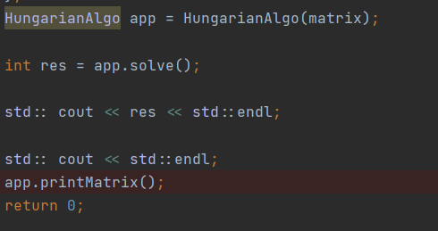
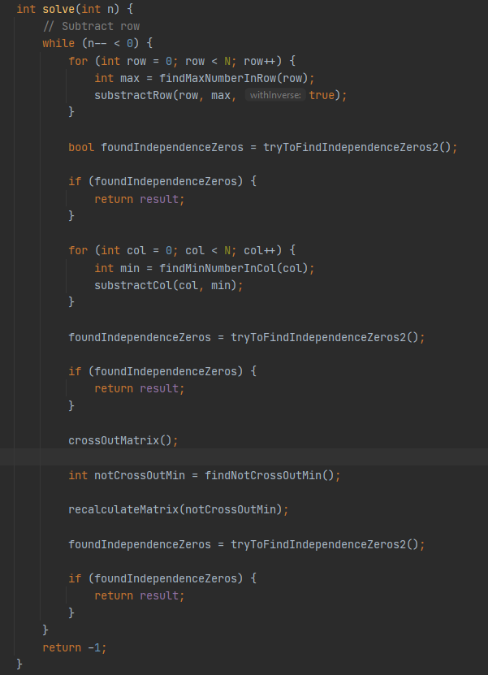

# HungarianAlgo
DESCRIPTION
Wiki:
  The Hungarian method is a combinatorial optimization algorithm that solves the assignment problem in polynomial time and which anticipated later primal–dual methods. It was developed and published in 1955 by Harold Kuhn, who gave the name "Hungarian method" because the algorithm was largely based on the earlier works of two Hungarian mathematicians: Dénes Kőnig and Jenő Egerváry.
  
  
Algorithm was implemented in C++. To implement this algorithm I use 2 class first class is HungarianAlgo - it`s a main class that contains all operation with matrix like crossout row, crossout columns, etc. Second class is Number class for number operation abstraction.
  

To solve this algorithm you can simply create HungarianAlgo object and pass matrix with Number object in a contructor

Step of algorithm executions: 

1) Subtract every row by it max element and multiply all row by -1

2) Try to find zeros in every row if success finish algo

3) Subtract every col by it min element

4) Try to find zeros in every row if success finish algo

5) Crossout rows and cols with zeros

6) Try to find zeros in every row if success finish algo

7) Repeat until not find result

